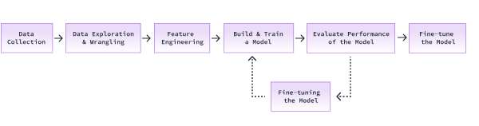

# The Machine Learning Workflow

## Concepts

`Machine Learning` enables us to build mathematical `models` that can identify and learnpatterns from given data on their own and make predictions on unseen data.

The `machine learning workflow` contains the following series of steps:\


For tabular data:
- A column is called a `feature`. It describes or is a property of our data
- The feature that we want our model to predict is called the `target variable`
- A row is called an `observation` or `feature vector`

### Federated Learning in Machine Learning

Federated Learning (FL) is **not a separate category** of Machine Learning (ML) like Supervised, Unsupervised, or Reinforcement Learning. Instead, **it is a training paradigm** that can be applied to any of these ML types:

1. Supervised Learning – Most common use case  
- FL is often used for training supervised models where labeled data exists but is distributed across multiple devices (e.g., predicting next-word suggestions in mobile keyboards).  
- **Example:** Google’s Gboard keyboard trains a supervised learning model across user devices.

2. Unsupervised Learning – Possible but less common  
- FL can be used for clustering, anomaly detection, or dimensionality reduction without centralized data collection.  
- **Example:** Federated clustering of IoT sensor data across different smart homes.

3. Reinforcement Learning (RL) – Rare, but possible  
- FL can be applied in RL scenarios where multiple distributed agents learn policies collectively.  
- **Example:** Federated RL for autonomous vehicles learning to navigate different environments.

In `supervised machine learning`, a machine learning model learns from, or is trained on, datathat has labels or classes for every observation
- The labels can be continuous or categorical values

For `classification` tasks, the model, also called a `classifier`, learns to predict categorical labels
- If there are only two labels, it's called `binary classification`
- If there are more than two labels, it's called `multi-class classification`

Data used to train a model is called `training data`, a `training set` or a `training dataset`

Data used to test a model is called `test data`,a `test set` or a `test dataset`
- The test set can be obtained by splitting the original dataset into a training and test set
- The test set's size is usually about `15 to 20%` of the original dataset

A classifier's performance can be evaluated by calculating its accuracy. The accuracy of amodel can be calculated by comparing those predictions to the actual labels.

Every model has its own set of parameters that can be tuned as an attempt to improve themodel's performance

## Syntax

Loading the Breast Cancer Wisconsin (Diagnostic) Dataset in scikit-learn into a PandasDataFrame

```python
cancer_data = load_breast_cancer(as_frame=True)
cancer_df = cancer_data.data
cancer_df['target'] = cancer_data.target
```

Preparing and splitting the dataset into training and test datasets

```python
from sklearn.model_selection import train_test_split
X = cancer_df.drop(["target"], axis=1)
y = cancer_df["target"]
X_train, X_test, y_train, y_test = train_test_split(X, y, test_size=0.15, random_state=417)
```

Building and training a LinearSVC model in scikit-learn

```python
model = LinearSVC(penalty="l2", loss="squared_hinge", C=10, random_state=417)
model.fit(X_train, y_train)
```

Calculating the accuracy of a model in scikit-learn

```python
model.score(X_test, y_test)
```

## Reference

[Machine Learning in Python by **Dataquest Labs, Inc**](https://app.dataquest.io/learning/path/machine-learning-in-python-skill/)