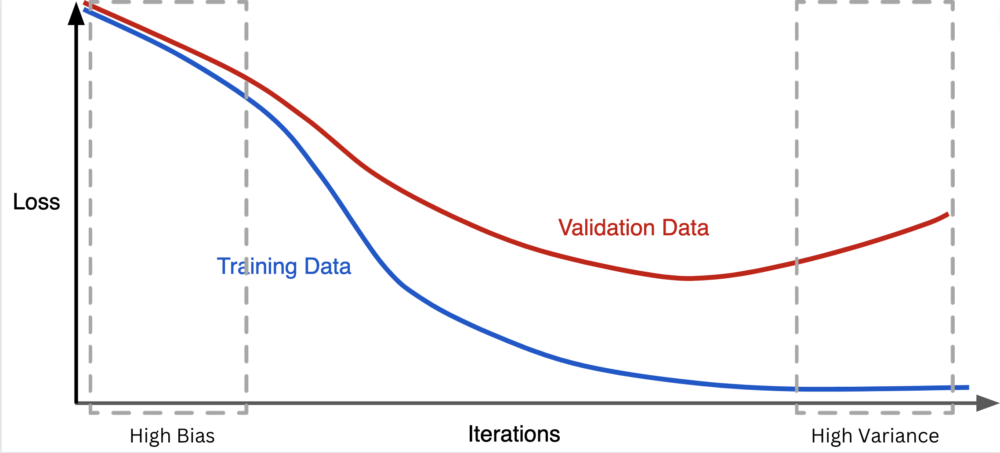
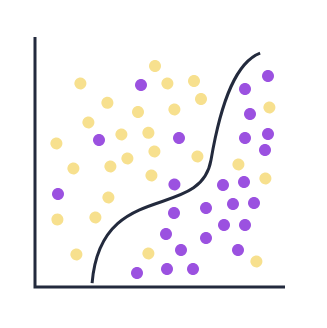
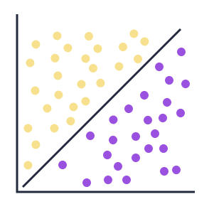
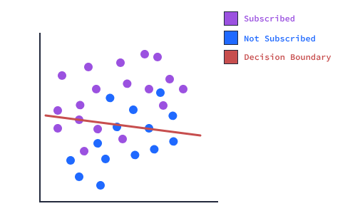

# Evaluating Model Performance

## Concept

A validation set is a data set that can be used to evaluate a trained machine learning model

In `scikit-learn`, the `fit()` method of the `KNeighborsClassifier` sets up the data structurethat allows for the model to efficiently identify the nearest neighbors

Both the validation and the test sets should be transformed or processed similarly to the way thetraining set was transformed in order to evaluate the model.

A model `overfits` when it starts to memorize parts of the data instead of generalizing it.

A model `underfits` when it struggles to accurately represent the data.

## Underfitting and Overfitting

Selecting two drastically different values for $K$ results in different model accuracies. One performs much better than the other. This difference in performance highlights a crucial concept in machine learning: the balance between underfitting and overfitting. In machine learning, our goal is to create models that generalize well to new, unseen data. However, finding the right balance can be challenging, and two common issues that can arise are underfitting and overfitting.

Let's explore these concepts using the K-Nearest Neighbors (KNN) algorithm, focusing on how different values of $K$ can lead to these issues:
- When $K$ is too small (e.g., $K = 1$), the model may overfit the data.
- When $K$ is too large (e.g., $K = 100$), the model may underfit the data.
- An appropriate middle value of $K$ can lead to a good fit that generalizes well.

In practice, we aim to find the optimal K value that balances between overfitting and underfitting, resulting in a model that generalizes well to new data. This process often involves techniques like cross-validation.

## **Why Models Overfit and How to Address It**

Overfitting happens when a machine learning model learns the training data too well, including its noise and minor details. This results in a model that performs exceptionally on the training data but struggles to generalize to new, unseen data.



Minimizing training loss might seem like the ultimate goal, but it’s not the whole story. As the training loss decreases, the validation loss often starts to rise after a certain point. This trend indicates that the model is becoming too complex, capturing not only the underlying patterns but also the noise in the training data. As a result, it struggles to generalize to new data.

On the other hand, in the high-bias region of the graph, the model is too simple to capture the data's complexity. This results in high training and validation losses that are very similar, indicating underfitting. While there’s no gap between the two losses, the overall performance remains poor because the model is unable to learn the underlying patterns in the data.

Preventing overfitting is critical for building machine learning models that perform well on unseen data.

## Sample code

This code demonstrates how different values of K affect the model's performance:

```python
from sklearn.neighbors import KNeighborsClassifier
from sklearn.model_selection import train_test_split
from sklearn.datasets import make_classification

# Create a synthetic dataset
X, y = make_classification(n_samples=1000, n_features=2, n_informative=2, n_redundant=0, random_state=42)

# Split the data into training and test sets
X_train, X_test, y_train, y_test = train_test_split(X, y, test_size=0.2, random_state=42)

# Function to evaluate model
def evaluate_model(k):
    knn = KNeighborsClassifier(n_neighbors=k)
    knn.fit(X_train, y_train)
    train_accuracy = knn.score(X_train, y_train)
    test_accuracy = knn.score(X_test, y_test)
    return train_accuracy, test_accuracy

# Evaluate models with different k values
k_1 = evaluate_model(1)
k_5 = evaluate_model(5)
k_100 = evaluate_model(100)

print(f"K=1: Train Accuracy: {k_1[0]:.4f}, Test Accuracy: {k_1[1]:.4f}")
print(f"K=5: Train Accuracy: {k_5[0]:.4f}, Test Accuracy: {k_5[1]:.4f}")
print(f"K=100: Train Accuracy: {k_100[0]:.4f}, Test Accuracy: {k_100[1]:.4f}")
```

Output:
```python
K=1: Train Accuracy: 1.0000, Test Accuracy: 0.9000
K=5: Train Accuracy: 0.9313, Test Accuracy: 0.9350
K=100: Train Accuracy: 0.8750, Test Accuracy: 0.9100
```

This code demonstrates how different values of K affect the model's performance:
1. Overfitting (K=1): Train Accuracy: 1.0000, Test Accuracy: 0.9000
- The model has a perfect score on the training data (1.0000) but a lower score on the test data (0.9000).
- This indicates overfitting: the model has memorized the training data perfectly but doesn't generalize as well to new data.

\
_Overfitting: Overly complex decision boundary_

2. Good Fit (K=5): Train Accuracy: 0.9313, Test Accuracy: 0.9350
- The model performs similarly on both training and test data, with the test accuracy even slightly higher.
- This suggests a good balance: the model generalizes well to new data.

\
_Good Fit: Balanced decision boundary_

3. Slight Underfitting (K=100):Train Accuracy: 0.8750, Test Accuracy: 0.9100
- Both accuracies are lower than K=5, indicating the model might be too simple.
- Interestingly, the test accuracy is higher than the training accuracy, which can happen with high K values as the model becomes very generalized.

\
_Underfitting: Overly simple decision boundary_

## Reference

[Machine Learning in Python by **Dataquest Labs, Inc**](https://app.dataquest.io/learning/path/machine-learning-in-python-skill/)