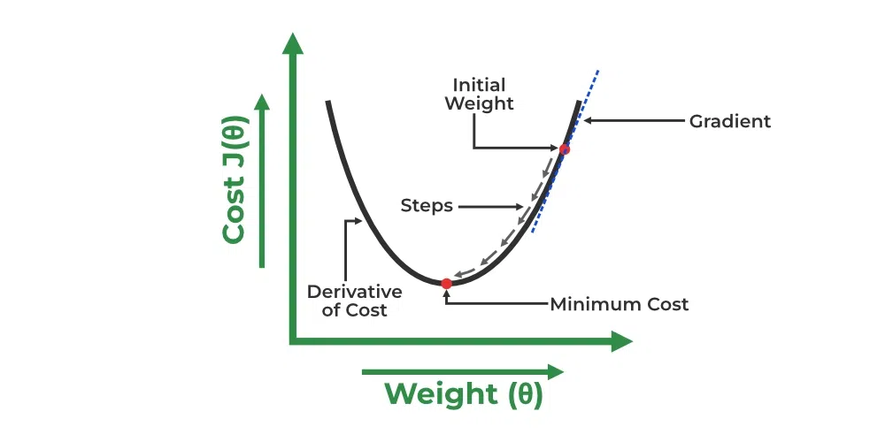

# Gradient Descent for Linear Regression

A linear regression model can be trained using the optimization algorithm `gradient descent` by iteratively modifying the model’s parameters to reduce the `mean squared error (MSE)` of the model on a training dataset. To update θ1 and θ2 values in order to reduce the Cost function (minimizing RMSE value) and achieve the best-fit line the model uses Gradient Descent. The idea is to start with random $\theta_1$ and $\theta_2$ values and then iteratively update the values, reaching minimum cost. 

The cost function (J) with respect to $\theta_1$
$$
\begin{aligned}
J^{\prime} \theta_{1} & =\frac{\partial J\left(\theta_{1}, \theta_{2}\right)}{\partial \theta_{1}} \\
& =\frac{\partial}{\partial \theta_{1}}\left[\frac{1}{n}\left(\sum_{i=1}^{n}\left(\hat{y}_{i}-y_{i}\right)^{2}\right)\right] \\
& =\frac{1}{n}\left[\sum_{i=1}^{n} 2\left(\hat{y}_{i}-y_{i}\right)\left(\frac{\partial}{\partial \theta_{1}}\left(\hat{y}_{i}-y_{i}\right)\right)\right] \\
& =\frac{1}{n}\left[\sum_{i=1}^{n} 2\left(\hat{y}_{i}-y_{i}\right)\left(\frac{\partial}{\partial \theta_{1}}\left(\theta_{1}+\theta_{2} x_{i}-y_{i}\right)\right)\right] \\
& =\frac{1}{n}\left[\sum_{i=1}^{n} 2\left(\hat{y}_{i}-y_{i}\right)(1+0-0)\right] \\
& =\frac{1}{n}\left[\sum_{i=1}^{n}\left(\hat{y}_{i}-y_{i}\right)(2)\right] \\
& =\frac{2}{n} \sum_{i=1}^{n}\left(\hat{y}_{i}-y_{i}\right)
\end{aligned}
$$

The cost function (J) with respect to $\theta_2$
$$
\begin{aligned}
J^{\prime} \theta_{2} & =\frac{\partial J\left(\theta_{1}, \theta_{2}\right)}{\partial \theta_{2}} \\
& =\frac{\partial}{\partial \theta_{2}}\left[\frac{1}{n}\left(\sum_{i=1}^{n}\left(\hat{y}_{i}-y_{i}\right)^{2}\right)\right] \\
& =\frac{1}{n}\left[\sum_{i=1}^{n} 2\left(\hat{y}_{i}-y_{i}\right)\left(\frac{\partial}{\partial \theta_{2}}\left(\hat{y}_{i}-y_{i}\right)\right)\right] \\
& =\frac{1}{n}\left[\sum_{i=1}^{n} 2\left(\hat{y}_{i}-y_{i}\right)\left(\frac{\partial}{\partial \theta_{2}}\left(\theta_{1}+\theta_{2} x_{i}-y_{i}\right)\right)\right] \\
& =\frac{1}{n}\left[\sum_{i=1}^{n} 2\left(\hat{y}_{i}-y_{i}\right)\left(0+x_{i}-0\right)\right] \\
& =\frac{1}{n}\left[\sum_{i=1}^{n}\left(\hat{y}_{i}-y_{i}\right)\left(2 x_{i}\right)\right] \\
& =\frac{2}{n} \sum_{i=1}^{n}\left(\hat{y}_{i}-y_{i}\right) \cdot x_{i}
\end{aligned}
$$

Finding the coefficients of a linear equation that best fits the training data is the objective of linear regression. By moving in the direction of the Mean Squared Error negative gradient with respect to the coefficients, the coefficients can be changed. And the respective intercept and coefficient of $X$ will be if $\alpha$ is the learning rate.

$$
\begin{aligned}
\theta_{1} & =\theta_{1}-\alpha\left(J^{\prime} \theta_{1}\right) \\
& =\theta_{1}-\alpha\left(\frac{2}{n} \sum_{i=1}^{n}\left(\hat{y}_{i}-y_{i}\right)\right) \\
\theta_{2} & =\theta_{2}-\alpha\left(J^{\prime} \theta_{2}\right) \\
& =\theta_{2}-\alpha\left(\frac{2}{n} \sum_{i=1}^{n}\left(\hat{y}_{i}-y_{i}\right) \cdot x_{i}\right)
\end{aligned}
$$

## Reference

[Linear Regression in Machine learning by **GeeksforGeeks**](https://www.geeksforgeeks.org/ml-linear-regression/)

