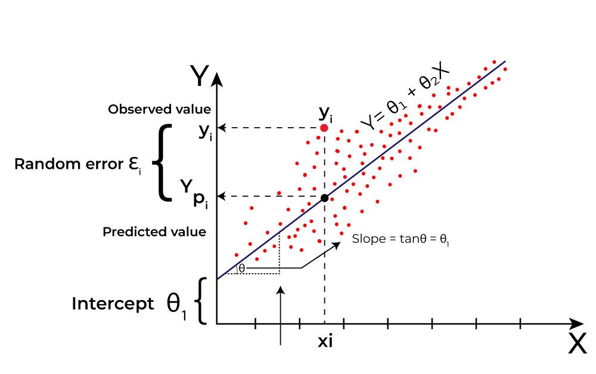

# Linear Regression in Machine learning

Linear regression is a statistical method used to model the relationship between a dependent variable and one or more independent variables. It provides valuable insights for prediction and data analysis. This article will explore its types, assumptions, implementation, advantages, and evaluation metrics.

## Concept

Linear regression is also a type of `supervised machine-learning algorithm` that learns from the labelled datasets and maps the data points with most optimized linear functions which can be used for prediction on new datasets. It computes the linear relationship between the dependent variable and one or more independent features by fitting a linear equation with observed data. It predicts the continuous output variables based on the independent input variable.

The interpretability of linear regression is one of its greatest strengths. The model’s equation offers clear coefficients that illustrate the influence of each independent variable on the dependent variable, enhancing our understanding of the underlying relationships. Its simplicity is a significant advantage; linear regression is transparent, easy to implement, and serves as a foundational concept for more advanced algorithms.

### What is `the best Fit Line`

Our primary objective while using linear regression is to locate the best-fit line, which implies that the error between the predicted and actual values should be kept to a minimum. There will be the least error in the best-fit line.

The best Fit Line equation provides a straight line that represents the relationship between the dependent and independent variables. The slope of the line indicates how much the dependent variable changes for a unit change in the independent variable(s).

Here $Y$ is called a dependent or target variable and $X$ is called an independent variable also known as the predictor of $Y$. There are many types of functions or modules that can be used for regression. A linear function is the simplest type of function. Here, $X$ may be a single feature or multiple features representing the problem.

Linear regression performs the task to predict a dependent variable value ($y$) based on a given independent variable ($x$). In the figure above, $X$ (input) is the work experience and $Y$ (output) is the salary of a person. The regression line is the best-fit line for our model.

In linear regression some `hypothesis` are made to ensure reliability of the model’s results.

### Hypothesis function in Linear Regression

> Assumptions:
> - Linearity: It assumes that there is a linear relationship between the independent and dependent variables. This means that changes in the independent variable lead to proportional changes in the dependent variable.
> - Independence: The observations should be independent from each other that is the errors from one observation should not influence other. 
>
> In the figure above, X (input) is the work experience and Y (output) is the salary of a person. The regression line is the best-fit line for our model.

Then the salary can be predicted using:
$$\hat{Y} = \theta_1 + \theta_2X$$
OR
$$\hat{y_i} = \theta_1 + \theta_2x_i$$

Here,
- $y_i \in Y (i = 1,2,...,n)$ are labels to data (Supervised learning)
- $x_i \in X (i = 1,2,...,n)$ are the input independent training data (univariate – one input variable(parameter)) 
- $\hat{y_i} \in \hat{Y} (i = 1,2,...,n)$ are the predicted values.

The model gets the best regression fit line by finding the best $\theta_1$ and $\theta_2$ values. 
- $\theta_1$: intercept
- $\theta_2$: coefficient of x

To achieve the best-fit regression line, the model aims to predict the target value $\hat{Y}$ such that the error difference between the predicted value $\hat{Y}$ and the true value $Y$ is minimum. So, it is very important to update the $\theta_1$ and $\theta_2$ values, to reach the best value that minimizes the error between the `predicted $\hat{Y}$ value` and the `true $Y$ value`. 

$$
\operatorname{minimize} \frac{1}{n} \sum_{i=1}^n\left(\hat{y}_i-y_i\right)^2
$$

## Types of Linear Regression in Machine Learning

### 1. Simple Linear Regression

Simple Linear Regression models the relationship between a single independent variable \( X \) and a dependent variable \( Y \) using a straight-line equation:

$$
Y = \beta_0 + \beta_1X + \varepsilon
$$

Where:
- $Y$ is the dependent variable
- $X$ is the independent variable
- $\beta_0$ is the intercept
- $\beta_1$ is the coefficient (slope of the line)
- $\varepsilon$ is the error term

Example Use Case:
- Predicting house prices based on square footage.

### 2. Multiple Linear Regression

Multiple Linear Regression extends Simple Linear Regression by incorporating multiple independent variables:

$$
Y = \beta_0 + \beta_1X_1 + \beta_2X_2 + \dots + \beta_nX_n + \varepsilon
$$

Where:
- $Y$ is the dependent variable
- $X1, X2,...,X_n$ are the independent variables
- $\beta_0$ is the intercept
- $\beta_1,\beta_2,...,\beta_n$ is the coefficients (slopes)
- $\varepsilon$ is the error term

Example Use Case:
- Predicting a car's price based on features like mileage, age, horsepower, and brand.

## Cost function for Linear Regression

The difference between the predicted value $\hat{Y}$ and the true value $Y$ and it is called `cost function` or the `loss function`.

In Linear Regression, the Mean Squared Error (MSE) cost function is employed, which calculates the average of the squared errors between the predicted values $\hat{y_i}$ and the actual values $y_i$. The purpose is to determine the optimal values for the intercept $\theta_1$ and the coefficient of the input feature $\theta_2$ providing the best-fit line for the given data points. The linear equation expressing this relationship is
$$\hat{y_i} = \theta_1 + \theta_2x_i$$

MSE function can be calculated as:
$$
\text { Cost function }(J)=\frac{1}{n} \sum_n^i\left(\hat{y}_i-y_i\right)^2
$$

Utilizing the MSE function, the iterative process of `gradient descent` is applied to update the values of $\theta_1$ & $\theta_2$. This ensures that the MSE value converges to the global minima, signifying the most accurate fit of the linear regression line to the dataset.

This process involves continuously adjusting the parameters $\theta_1$ & $\theta_2$ based on the gradients calculated from the MSE. The final result is a linear regression line that minimizes the overall squared differences between the predicted and actual values, providing an optimal representation of the underlying relationship in the data.

## Reference

[Linear Regression in Machine learning by **GeeksforGeeks**](https://www.geeksforgeeks.org/ml-linear-regression/)